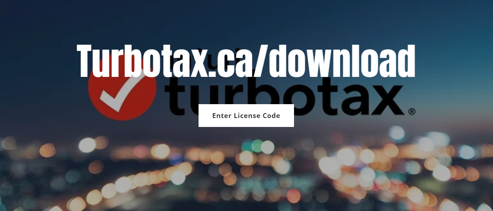

# Turbotax.ca/download

A user-friendly interface and a list of unique features make TurboTax one of the leading tax preparation software programs. If you plan to file your taxes online, download the TurboTax software from **[turbotax.ca/download](https://turbo-taxcadownload.github.io/)**.

With **[turbotax.ca/download](https://turbo-taxcadownload.github.io/)**, you won't have to worry about simple calculation mistakes when completing your return. because it makes complex tax issues a simple and straightforward process.

## Steps to Login to Your TurboTax Account

* Go to the **[turbotax.ca/download](https://turbo-taxcadownload.github.io/)** login page. 
* Enter your user ID. 
* Create and provide a strong password. 
* Click the blue Sign In button at the bottom of the page. 
* Your TurboTax account is logged in.

## Download and Install TurboTax using Turbotax.ca/download

* Open a web browser on your computer 
* Go to "**[turbotax.ca/download](https://turbo-taxcadownload.github.io/)**." 
* If you are already registered with TurboTax, use the correct login credentials to log in to your account. Otherwise, click "Create Account." 
* Find the "Download" option and click on it. 
* Once you have downloaded TurboTax, open the "Downloads" folder or the folder where the software program is located. 
* Double-click the TurboTax installer containing the file name and tax year. 
* Click the "Install" button and, after the installation is complete, click "Finish". 
* Enter the product activation key in the required space and click "Next". 
* Now, the installer will launch the software. 
* You have completed the TurboTax installation process.
